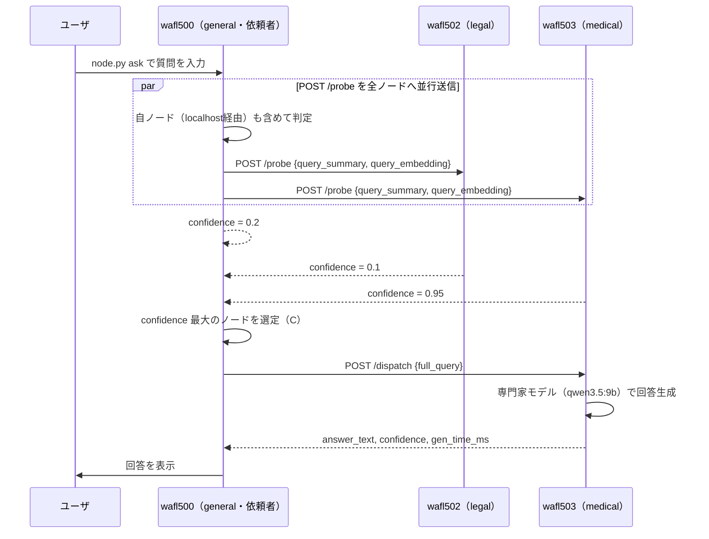
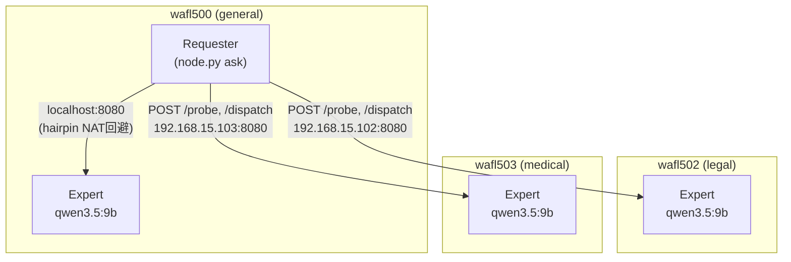
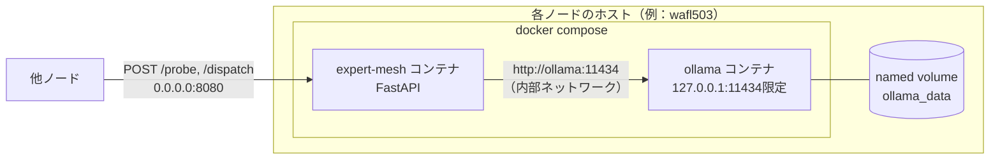
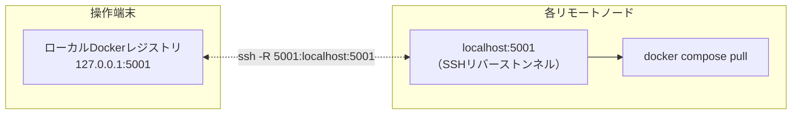

# 出会い型専門家メッシュ

本リポジトリは，中央サーバを持たない複数のノート PC が，有線 LAN 上で対等に接続し，各ノードが持つ専門分野の LLM へ質問を自律的にルーティングする仕組みの実装である．技術設計書 v2（有線 LAN 常時接続・HTTP POST プロトコル版）に基づく Phase 0（基礎的な実現可能性の検証フェーズ）のコードであり，「専門を分担し，担当デバイスが答える」という協調推論の枠組みを，中央集権的なルータなしに実現できるかを検証することを目的とする．

## 目次

- [設計思想](#設計思想)
- [アーキテクチャ](#アーキテクチャ)
- [通信プロトコル](#通信プロトコル)
- [ディレクトリ構成](#ディレクトリ構成)
- [セットアップと実行](#セットアップと実行)
- [設定ファイル（config.yaml）](#設定ファイルconfigyaml)
- [Docker アーキテクチャとデプロイの仕組み](#docker-アーキテクチャとデプロイの仕組み)
- [技術的な工夫と実機検証で得られた知見](#技術的な工夫と実機検証で得られた知見)
- [テスト](#テスト)
- [既知の制約と今後の課題](#既知の制約と今後の課題)

## 設計思想

各ノードは以下の 2 つの役割を同時に持つ，対等（symmetric）なプロセスである．

- **専門家（Expert）としての機能**：自分の専門分野の LLM をローカルで動かし，他ノードからの質問に回答する．
- **依頼者（Requester）としての機能**：ユーザからの質問を受け取り，他ノードへ HTTP POST で問い合わせを行い，最も適した専門家へ回答生成を委譲する．

マスターノードは存在せず，「誰がどの分野を担当するか」は `config.yaml` という静的な設定ファイルで宣言する．ノード間の発見は mDNS 等の動的プロトコルではなく，あらかじめ記載されたホスト一覧に基づく．これは，無線アドホック環境における動的な「出会い」の実現可能性を検証する前段階として，まず有線 LAN・静的トポロジー下で「専門分担・ルーティングの仕組みそのもの」が機能するかを切り分けて確認するための意図的な単純化である．

質問への応答は，次の 2 段階のプロトコルによって行われる．

1. **`/probe`（軽い問い合わせ）**：依頼者は全ノードへ質問の要約を並行して送り，各ノードは自身の軽量モデルを使って「この質問にどの程度対応できるか」を 0.0〜1.0 の confidence 値として自己申告する．
2. **`/dispatch`（本問い合わせ）**：依頼者は confidence が最も高いノードへ質問全文を送り，そのノードの専門家モデル（本実装では軽量モデルと同一）が本回答を生成する．

全体の流れは次の通りである．



## アーキテクチャ

### ノード構成（Phase 0 の実機）

Phase 0 では，同一 LAN 上のノート PC 3 台を用いる．各ノードには一意なドメインが割り当てられ，このうち 1 台は依頼者を兼任する汎用ノード（`general`）として機能する．

| node_id | domain  | 役割                           |
| ------- | ------- | ------------------------------ |
| wafl500 | general | 汎用フォールバック・依頼者兼任 |
| wafl502 | legal   | 法律分野の専門家               |
| wafl503 | medical | 医療分野の専門家               |

各ノードは対等であり，マスターは存在しない．全ノードが expert と requester の両方の機能を同時に持つ点を図示すると次の通りである．



ノード名・IP アドレス・担当ドメイン・使用モデルは，すべて `config.yaml` の 1 ファイルに集約している．これはホスト名や IP アドレスをコード中にハードコードせず，実験環境の変更（ノート PC の入れ替えやドメイン再割当）を設定ファイルの更新だけで完結させるための設計判断である．

### 推論エンジン

CPU のみのノート PC で動作させるため，Qwen3.5 系のモデル（Alibaba Qwen チームによる Mixture-of-Experts アーキテクチャ）を採用している．

| 用途                              | モデル             | 備考                                                                                                       |
| --------------------------------- | ------------------ | ---------------------------------------------------------------------------------------------------------- |
| confidence 判定（旧：軽量モデル） | `qwen3.5:9b`       | 精度検証の結果，`qwen3.5:2b` では専門外の質問を誤判定する事例が確認されたため，9b に統一した（詳細は後述） |
| 本回答生成（専門家モデル）        | `qwen3.5:9b`       | 実測で約 3 tok/s（CPU 推論）                                                                               |
| 質問の埋め込み生成                | `nomic-embed-text` | 方式 A（意味的ルーティング）比較用に，全ノードで同一モデル・同一次元数を使用                               |

confidence 判定と本回答生成に同一モデルを使う構成になっている点は，設計書が本来想定する「軽量モデルによる高速な足切り＋専門家モデルによる高品質な本回答」という 2 段構えの利点を薄めるが，実機検証で軽量モデル（2B 級）ではルーティング精度が不十分であることが判明したため，Phase 0 では精度を優先した．モデルサイズと判定精度のトレードオフの詳細な評価は Phase 1 以降の課題である．

## 通信プロトコル

すべてのノード間通信は，JSON ボディを持つ HTTP POST で統一されている．UDP ブロードキャストや mDNS のような発見プロトコルは用いない．

### `POST /advertise`

自ノードの現在状態をピアへ周知するハートビート．Phase 0 では受信側（`/advertise` エンドポイント）のみを実装しており，能動的な定期送信は行っていない（設計書で「低頻度でよい・任意」とされているため）．

```json
// Request
{
  "node_id": "wafl502",
  "domain": "legal",
  "domain_embedding": [0.12, -0.03],
  "load": 0.2,
  "timestamp": 1730000000
}
// Response
{"status": "ok"}
```

### `POST /probe`

依頼者から各ノードへ，担当可否のみを問い合わせる．軽量な確認のため，質問の要約（`query_summary`）のみを渡す．

```json
// Request
{
  "request_id": "uuid-1234",
  "query_summary": "頭痛と発熱についての質問",
  "query_embedding": [0.08, 0.11],
  "from": "wafl500"
}
// Response
{
  "request_id": "uuid-1234",
  "node_id": "wafl503",
  "confidence": 0.95,
  "estimated_latency_ms": 21340
}
```

### `POST /dispatch`

依頼者から，confidence が最も高かったノードへ，質問全文を渡して本回答を依頼する．

```json
// Request
{"request_id": "uuid-1234", "full_query": "3日前から頭痛と38度の発熱が続いています．"}
// Response
{
  "request_id": "uuid-1234",
  "node_id": "wafl503",
  "answer_text": "...",
  "confidence": 0.95,
  "gen_time_ms": 173150
}
```

### エラーレスポンス

すべてのエンドポイントで共通のエラー形式を用いる．

```json
{"error": "invalid request"}   // 400: JSONスキーマ不正
{"error": "model not ready"}   // 503: ollamaへの接続失敗
{"error": "timeout"}           // 504: probe_timeout_s / dispatch_timeout_s 超過
```

## ディレクトリ構成

```
expert-mesh/
├── mise.toml                # mise タスク定義（setup/deploy/start/analyze/clean）
├── mise-tasks/               # 各タスクの実体（実行可能シェルスクリプト）
│   ├── setup                  # ローカル：uv sync／Dockerレジストリ起動／イメージbuild&push
│   ├── deploy                  # リモート：SSHトンネル確立／配布／イメージpull／モデルpull
│   ├── start                    # リモート：コンテナ起動／ウォームアップ待ち／healthcheck
│   ├── analyze                   # リモート：ログ回収
│   └── clean                      # リモート：クリーンアップ（コンテナのみ／完全削除）
├── pyproject.toml            # uv 管理の依存関係定義
├── Dockerfile                 # expert-mesh アプリのコンテナイメージ
├── docker-compose.yml          # 各ノードで起動する ollama + expert-mesh の2サービス定義
├── config.yaml                  # ノード一覧・モデル設定・タイムアウト等の一元設定ファイル
├── protocol.py                   # pydantic による /advertise, /probe, /dispatch のスキーマ定義
├── expert_backend.py               # ollama の /api/chat, /api/embeddings への非同期クライアント
├── router.py                        # confidence 算出ロジック（方式B：自己申告スコアリング）
├── aggregator.py                     # probe 結果の集約・confidence 上位ノードの選定
├── http_client.py                     # 他ノードへの並行 HTTP POST クライアント
├── http_server.py                      # FastAPI による /advertise, /probe, /dispatch サーバ
├── node.py                              # CLI エントリポイント（serve / ask サブコマンド）
├── tools/
│   ├── list_peers.py                     # config.yaml から node_id 一覧を出力
│   ├── node_models.py                     # config.yaml から指定ノードの使用モデル一覧を出力
│   ├── remote_dir.py                       # config.yaml からリモート配置先ディレクトリを出力
│   └── healthcheck.py                       # 全ノードへの /advertise 疎通確認
└── tests/                                    # 単体テスト（LLM 呼び出し部分はモック）
```

## セットアップと実行

### 前提条件

- 操作端末・各ノードとも Docker（containerd イメージストアではなく classic overlay2 ドライバ推奨）が導入済みであること
- 操作端末から各ノードへ SSH 接続できること（`~/.ssh/config` にホストエイリアスを設定しておく）
- `uv`（Python パッケージマネージャ）が操作端末に導入済みであること
- `mise`（タスクランナー）が操作端末に導入済みであること

操作端末はノードの LAN（実験環境では `192.168.15.0/24`）に直接参加しているとは限らない．本実装は，操作端末が SSH 経由でしか各ノードへ到達できない環境（踏み台・ProxyJump 経由）を前提に設計されている．そのため，ノード間の実際の通信確認（`/probe` の疎通等）は，いずれかのノードのコンテナ内から行う必要がある．

### mise タスクの一覧

| タスク                     | 実行場所          | 内容                                                                                           |
| -------------------------- | ----------------- | ---------------------------------------------------------------------------------------------- |
| `mise run setup`           | 操作端末          | `uv sync`，ローカル Docker レジストリの起動，`expert-mesh` イメージの build と push            |
| `mise run deploy`          | 操作端末→各ノード | SSH リバーストンネルの確立，`docker-compose.yml`・`config.yaml` の配布，イメージ・モデルの取得 |
| `mise run start`           | 操作端末→各ノード | コンテナの起動（`--force-recreate`），ウォームアップ完了待ち，全ノードへの healthcheck         |
| `mise run analyze`         | 操作端末→各ノード | 各ノードのコンテナログを `logs/<node_id>/` へ回収                                              |
| `mise run clean`           | 操作端末→各ノード | コンテナの停止・削除（モデルデータは保持）                                                     |
| `mise run clean -- --full` | 操作端末→各ノード | コンテナ・モデルデータ（named volume）・イメージ・配布先ディレクトリを完全削除                 |

一連の実行順序は次の通りである．

```bash
mise run setup     # 初回のみ：ローカルでイメージを準備する
mise run deploy    # 各ノードへ配布し，イメージとモデルを取得する
mise run start     # 各ノードでサービスを起動する
# --- ここで実際に質問を投げて動作確認する（後述） ---
mise run analyze   # 実験ログを回収する
mise run clean      # 後片付け（必要に応じて --full）
```

### 質問を投げる（`node.py ask`）

`node.py` は依頼者・専門家の両方の役割を CLI サブコマンドで切り替える．専門家としての起動（`serve`）は `docker-compose.yml` の `command` から自動的に行われるため，通常は意識する必要がない．依頼者として質問を投げる場合は，いずれかのノードのコンテナ内で `ask` サブコマンドを実行する．

```bash
ssh <依頼者ノード> "cd <REMOTE_DIR> && docker compose exec -T expert-mesh \
  .venv/bin/python node.py ask --node-id <依頼者ノードのnode_id> '質問文'"
```

実行すると，全ノードへの `/probe` を並行実行し，confidence が閾値（`confidence_threshold`）以上のノードのうち最も confidence の高いノードへ `/dispatch` を送り，回答を標準出力へ表示する．

```
[wafl503] (confidence=0.95, 199383ms)
医学的専門家の観点から、ご質問にある「持続する頭痛」と「高熱（38℃）」という症状について解説します。
...
```

## 設定ファイル（config.yaml）

`config.yaml` は，全ノード共通の設定と，ノードごとの設定を一本化したファイルである．ホスト名・IP アドレス・モデル名・タイムアウト値・デプロイ先パスは，このファイルにのみ記載し，コード側にはハードコードしない．

```yaml
embedding_model: nomic-embed-text     # 全ノード共通（方式Aの比較のため統一必須）
confidence_threshold: 0.5             # この値未満のノードはdispatch対象から除外
probe_timeout_s: 60.0                 # confidence判定（9bモデル）の実測応答時間に基づく
dispatch_timeout_s: 200.0             # 本回答生成（9bモデル，最大512トークン）の実測時間に基づく
remote_dir: "~/workspace/ktakahashi/expert-mesh"  # 各リモートホスト上の配置先（~はリモート側で展開）

nodes:
  wafl500:
    host: 192.168.15.100
    port: 8080
    domain: general
    light_model: qwen3.5:9b
    expert_model: qwen3.5:9b
  # ...（wafl502, wafl503も同様の形式）
```

タイムアウト値は，設計書に記載された例示値（`/probe`=2秒，`/dispatch`=30秒）から，実機での計測結果に基づいて大幅に引き上げている．CPU 推論では，モデルサイズと生成トークン数に応じて応答時間が数十秒〜数百秒単位になるため，実測に基づかない見積もりでは容易にタイムアウトする．

## Docker アーキテクチャとデプロイの仕組み

### コンテナ構成

各ノードは `docker compose` により 2 つのサービスを起動する．

- **`ollama`**：公式 `ollama/ollama` イメージ．同一ホスト内の `expert-mesh` サービスとのみ通信すればよいため，`127.0.0.1` 限定でポートを公開し（デバッグ用），LAN 全体には公開しない．
- **`expert-mesh`**：本アプリケーションのイメージ．他ノードからの `/probe`・`/dispatch` を受け付ける必要があるため，`8080` 番ポートをホストの全インターフェースへ公開する．



### ローカルレジストリ経由のデプロイ

`expert-mesh` イメージは操作端末上でビルドし，操作端末上で起動したローカル Docker レジストリ（`registry:2`，ポート `5001`）へ push する．各リモートノードは，SSH のリバースポートフォワード（`ssh -R`）を通じてこのレジストリへ到達し，`docker compose pull` でイメージを取得する．レジストリは SSH トンネル経由でしかアクセスされないため，操作端末側でも `127.0.0.1` 限定で公開している．



なお，レジストリのポートは当初 `5000` を予定していたが，実験環境では別プロジェクト（WAFL-PEFT）が同じポートを持続的な SSH トンネルで使用していたことが判明したため，`5001` に変更した．ポート番号のような環境依存の値も，可能な限り実機で衝突を確認してから決定している．

## 技術的な工夫と実機検証で得られた知見

Phase 0 の実装は，設計書の記述をそのままコード化するだけでは動作せず，実機での検証を通じて多くの追加的な技術判断を要した．以下は，その過程で発見した問題と対処の記録である．

### 1. LLM の生成トークン数に上限を設けないと暴走する

`ollama` の `/api/generate`（および `/api/chat`）は `options.num_predict` を指定しない場合，デフォルトで無制限にトークンを生成し続ける．confidence 判定用の「短い JSON のみを出力してください」という指示は，あくまでモデルへの依頼であってデコーダへの制約ではないため，モデルが指示に従わない場合は際限なく生成が続き，タイムアウトに至る．`expert_backend.py` の `OllamaClient.generate` は `max_tokens` 引数を必須に近い形で受け取り，`router.py`（confidence 判定：100 トークン）と `http_server.py`（本回答生成：512 トークン）でそれぞれ用途に応じた上限を明示的に設定している．

### 2. thinking モデルは `/api/generate` では `think: false` が効かない

Qwen3.5 系は，最終回答の前に内部の思考過程を出力する「thinking」機能を持つ．ollama にはこれを無効化する `think` パラメータがあるが，`/api/generate` エンドポイントではこのフラグが無視されるという既知のバグがある（[ollama/ollama#14793](https://github.com/ollama/ollama/issues/14793)）．この状態で `num_predict` の上限を設定すると，思考過程の出力だけでトークン予算を使い切り，本来の応答（`response` フィールド）が空文字列のまま返ってくる．`expert_backend.py` では `/api/chat` エンドポイントを使用し，`think: false` を指定することでこれを回避している．

### 3. confidence の意味をモデルが取り違える

初期のプロンプトでは，モデルが判定理由（reasoning）としては正しく「この分野とは無関係」と導出できているにもかかわらず，`confidence` の数値だけ真逆（高い値）を出力する事例が確認された．これは，`confidence` という語を「質問がこの分野に該当する度合い」ではなく「自分の判定に対する自信度」と誤解したためと考えられる．`router.py` の `build_confidence_prompt` では，confidence の意味を明示的に定義し，few-shot 例を 2 つ添えることでこれを是正している．なお，few-shot 例に実際のテストクエリと類似した話題を使うと，モデルが例の数値をそのまま模倣してしまう（アンカリング効果）ため，例には実際の質問群とは無関係な固定の話題（歯の痛み・賃貸契約）を用いている．

### 4. フォールバック役ドメイン（`general`）は判定基準を反転させる必要がある

`general` ドメインに対して，他の専門ドメインと同じ「この分野の専門知識を要するか」という判定基準のプロンプトを使うと，モデルは「あらゆる質問は一般的な話題として該当しうる」と広く解釈し，専門ドメインのノードとほぼ同じ高い confidence を常に返してしまう．これでは，専門知識を要する質問に対しても `general` が僅差で競合し，選定結果が不安定になる．`router.py` では `GENERAL_DOMAIN` を特別扱いし，「専門知識を要する質問には低い値，日常的な質問には高い値」という逆の判定基準を持つ専用プロンプトを用意している．

### 5. `/dispatch` にはドメイン情報を明示的に含める必要がある

初期実装では，`/dispatch` は受け取った質問文をそのまま専門家モデルへ渡していた．しかしこれでは，モデルは自分がどの分野の専門家として振る舞うべきかという文脈を持たないため，どのノードが回答しても同じ一般的な内容になってしまう．`http_server.py` の `build_dispatch_prompt` は，`state.domain` を明示したプロンプトを組み立ててから専門家モデルへ渡すことで，ノードごとに異なる専門的な観点からの回答を実現している．

### 6. 起動直後のモデル未ロード（コールドスタート）

ollama はモデルへの初回リクエスト時に，ディスクからメモリへモデルを読み込む処理（モデルロード）を行う．このロード時間が `probe`/`dispatch` の応答時間計測に混入すると，レイテンシの内訳（通信時間 vs 推論時間）が不正確になる．`http_server.py` は FastAPI の `lifespan` を使い，サーバがリクエストを受け付け始める前に，軽量モデル・専門家モデルの両方に対して最小限の生成（1 トークン）を行うウォームアップ処理を実装している．ollama 自体の起動が完了する前にウォームアップを試みる可能性があるため，接続エラー時は一定間隔でリトライする．

### 7. `docker compose` はバインドマウントしたファイルの中身の変更を検知しない

`config.yaml` を更新して `rsync` で配布し直しても，`docker compose up -d` は「`docker-compose.yml` 自体に変更がなければ何もしない」と判断するため，既存のコンテナはバインドマウント元のファイルが更新された後も古い設定のまま動き続ける．これは，設定変更をいくら繰り返しても反映されていないように見える，気づきにくい落とし穴である．`mise-tasks/start` では `docker compose up -d --force-recreate expert-mesh` を用いることで，起動のたびに確実に最新の `config.yaml` を読み込むようにしている．あわせて，`rsync` のデフォルト動作（一時ファイルへ書き込んだ後に `rename` する）による inode の変化がバインドマウントの参照を狂わせる可能性を考慮し，`mise-tasks/deploy` の `rsync` には `--inplace` を付けてファイルを直接上書きするようにしている．

### 8. 自ノードへの到達性（hairpin NAT）

コンテナから自分自身のホストの外部 IP （かつ公開ポート）へ接続しようとすると，多くの Linux 環境では「hairpin NAT」が正しく機能せず接続できない．これは，`tools/healthcheck.py` が全ノード（自ノードを含む）へ `/advertise` を送る場合や，`node.py ask` の依頼者ノードが自分自身のドメインを兼任している場合（Phase 0 の `general` ノード）に問題となる．両者とも，自ノードの `node_id` と一致するピアに対しては，接続先ホストを外部 IP ではなく `localhost` に置き換える処理を実装している．

## テスト

単体テストは，LLM 呼び出しを含まない純粋なロジック（`protocol.py`・`router.py`・`aggregator.py`）と，`OllamaClient` をモックした FastAPI のエンドポイント契約（`http_server.py`）に分けて実装している．実機・実プロセス間の結合確認は `tools/healthcheck.py` や実際の `mise run start` を通じて行い，単体テストの対象外としている．

```bash
uv run pytest tests/ -v   # 単体テストの実行
uv run ruff check .       # 静的解析
```

## 既知の制約と今後の課題

- **ルーティング精度**：`qwen3.5:9b` への切り替えとプロンプト改善により，医療・法律・一般・複合ドメイン・無関係な質問を含む複数パターンで正しいノードが選定されることを実機で確認した．ただし，これは限られたテストケースでの確認であり，設計書が定義する評価軸（Top-k 正解率，適合率・再現率等）に基づく体系的な精度評価は Phase 1 の課題である．
- **回答生成の言語**：複合ドメインの質問に対して，選定自体は正しいにもかかわらず，回答が日本語ではない言語（中国語）で生成される事例が確認されている．これは `qwen3.5` の多言語対応モデルとしての特性に起因すると考えられ，ルーティングの正確性とは独立した課題である．
- **advertise の能動送信**：`/advertise` の受信処理は実装済みだが，各ノードが自身の状態を定期的に送信する能動的なハートビートは未実装である．
- **意味的ルーティング（方式A）**：`nomic-embed-text` による埋め込み生成は実装済みだが，埋め込みに基づくルーティング方式そのもの（方式A）と，本実装の自己申告スコアリング（方式B）との比較評価は行っていない．
- **無線アドホック化・ネットワーク不安定性への対応**：設計書が Phase 3 として明示的に切り出している課題であり，本フェーズのスコープには含まれない．
