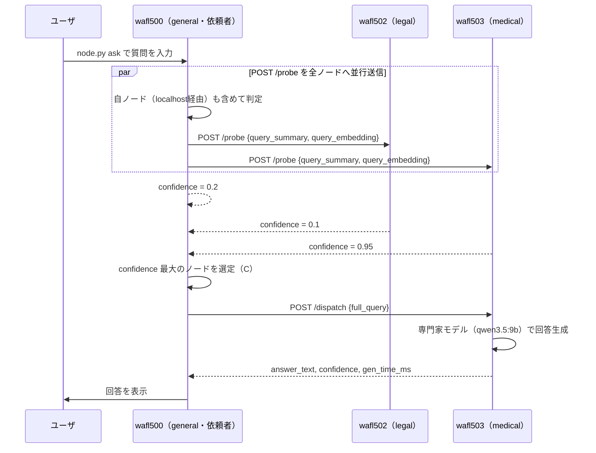
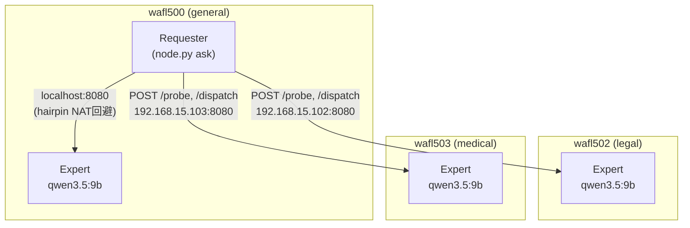
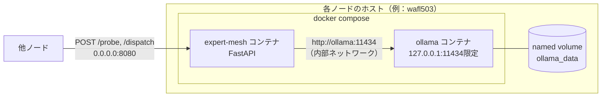
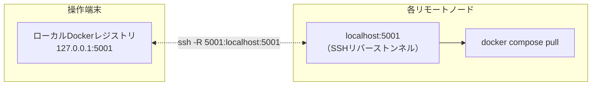

# 出会い型専門家メッシュ

本リポジトリは，中央サーバを持たない複数のノート PC が，有線 LAN 上で対等に接続し，各ノードが持つ専門分野の LLM へ質問を自律的にルーティングする仕組みの実装である．技術設計書 v2（有線 LAN 常時接続・HTTP POST プロトコル版）に基づき，「専門を分担し，担当デバイスが答える」という協調推論の枠組みを，中央集権的なルータなしに実現できるかを検証することを目的とする．Phase 0（基礎的な実現可能性の検証）に加えて，Phase 1（埋め込みベースルーティング，top-k dispatch）・Phase 2（評価用ベンチマーク基盤）の一部機能も実装している．

## 目次

- [設計思想](#設計思想)
- [アーキテクチャ](#アーキテクチャ)
- [通信プロトコル](#通信プロトコル)
- [ディレクトリ構成](#ディレクトリ構成)
- [セットアップと実行](#セットアップと実行)
- [設定ファイル（config.yaml）](#設定ファイルconfigyaml)
- [Docker アーキテクチャとデプロイの仕組み](#docker-アーキテクチャとデプロイの仕組み)
- [技術的な工夫と実機検証で得られた知見](#技術的な工夫と実機検証で得られた知見)
- [Phase 1: 埋め込みベースルーティング（方式A）](#phase-1-埋め込みベースルーティング方式a)
- [Phase 2: ベンチマーク基盤](#phase-2-ベンチマーク基盤)
- [テスト](#テスト)
- [既知の制約と今後の課題](#既知の制約と今後の課題)

## 設計思想

各ノードは以下の 2 つの役割を同時に持つ，対等（symmetric）なプロセスである．

- **専門家（Expert）としての機能**：自分の専門分野の LLM をローカルで動かし，他ノードからの質問に回答する．
- **依頼者（Requester）としての機能**：ユーザからの質問を受け取り，他ノードへ HTTP POST で問い合わせを行い，最も適した専門家へ回答生成を委譲する．

マスターノードは存在せず，「誰がどの分野を担当するか」は `config.yaml` という静的な設定ファイルで宣言する．ノード間の発見は mDNS 等の動的プロトコルではなく，あらかじめ記載されたホスト一覧に基づく．これは，無線アドホック環境における動的な「出会い」の実現可能性を検証する前段階として，まず有線 LAN・静的トポロジー下で「専門分担・ルーティングの仕組みそのもの」が機能するかを切り分けて確認するための意図的な単純化である．

質問への応答は，次の 2 段階のプロトコルによって行われる．

1. **`/probe`（軽い問い合わせ）**：依頼者は全ノードへ質問の要約を並行して送り，各ノードは自身の軽量モデルを使って「この質問にどの程度対応できるか」を 0.0〜1.0 の confidence 値として自己申告する．
2. **`/dispatch`（本問い合わせ）**：依頼者は confidence が最も高いノードへ質問全文を送り，そのノードの専門家モデル（本実装では軽量モデルと同一）が本回答を生成する．

全体の流れは次の通りである．



## アーキテクチャ

### ノード構成（Phase 0 の実機）

Phase 0 では，同一 LAN 上のノート PC 3 台を用いる．各ノードには一意なドメインが割り当てられ，このうち 1 台は依頼者を兼任する汎用ノード（`general`）として機能する．

| node_id | domain  | 役割                           |
| ------- | ------- | ------------------------------ |
| wafl500 | general | 汎用フォールバック・依頼者兼任 |
| wafl502 | legal   | 法律分野の専門家               |
| wafl503 | medical | 医療分野の専門家               |

各ノードは対等であり，マスターは存在しない．全ノードが expert と requester の両方の機能を同時に持つ点を図示すると次の通りである．



ノード名・IP アドレス・担当ドメイン・使用モデルは，すべて `config.yaml` の 1 ファイルに集約している．これはホスト名や IP アドレスをコード中にハードコードせず，実験環境の変更（ノート PC の入れ替えやドメイン再割当）を設定ファイルの更新だけで完結させるための設計判断である．

### 推論エンジン

CPU のみのノート PC で動作させるため，Qwen3.5 系のモデル（Alibaba Qwen チームによる Mixture-of-Experts アーキテクチャ）を採用している．

| 用途                              | モデル             | 備考                                                                                                       |
| --------------------------------- | ------------------ | ---------------------------------------------------------------------------------------------------------- |
| confidence 判定（旧：軽量モデル） | `qwen3.5:9b`       | 精度検証の結果，`qwen3.5:2b` では専門外の質問を誤判定する事例が確認されたため，9b に統一した（詳細は後述） |
| 本回答生成（専門家モデル）        | `qwen3.5:9b`       | 実測で約 3 tok/s（CPU 推論）                                                                               |
| 質問の埋め込み生成                | `nomic-embed-text` | 方式 A（意味的ルーティング）比較用に，全ノードで同一モデル・同一次元数を使用                               |

confidence 判定と本回答生成に同一モデルを使う構成になっている点は，設計書が本来想定する「軽量モデルによる高速な足切り＋専門家モデルによる高品質な本回答」という 2 段構えの利点を薄めるが，実機検証で軽量モデル（2B 級）ではルーティング精度が不十分であることが判明したため，Phase 0 では精度を優先した．モデルサイズと判定精度のトレードオフの詳細な評価は Phase 1 以降の課題である．

## 通信プロトコル

すべてのノード間通信は，JSON ボディを持つ HTTP POST で統一されている．UDP ブロードキャストや mDNS のような発見プロトコルは用いない．

### `POST /advertise`

自ノードの現在状態をピアへ周知するハートビート．各ノードは `serve` 起動時（FastAPI の `lifespan`）から，`ADVERTISE_INTERVAL_S`（既定 30 秒）間隔で全ピアへ能動的に送信する（`http_server.py` の `_advertise_loop`）．送信は best-effort であり，個々のピアへの送信失敗はハートビート全体を止めない．

```json
// Request
{
  "node_id": "wafl502",
  "domain": "legal",
  "domain_embedding": [0.12, -0.03],
  "load": 0.2,
  "timestamp": 1730000000
}
// Response
{"status": "ok"}
```

### `POST /probe`

依頼者から各ノードへ，担当可否のみを問い合わせる．軽量な確認のため，質問の要約（`query_summary`）のみを渡す．

```json
// Request
{
  "request_id": "uuid-1234",
  "query_summary": "頭痛と発熱についての質問",
  "query_embedding": [0.08, 0.11],
  "from": "wafl500"
}
// Response
{
  "request_id": "uuid-1234",
  "node_id": "wafl503",
  "confidence": 0.95,
  "estimated_latency_ms": 21340
}
```

### `POST /dispatch`

依頼者から，confidence が最も高かったノードへ，質問全文を渡して本回答を依頼する．

```json
// Request
{"request_id": "uuid-1234", "full_query": "3日前から頭痛と38度の発熱が続いています．"}
// Response
{
  "request_id": "uuid-1234",
  "node_id": "wafl503",
  "answer_text": "...",
  "confidence": 0.95,
  "gen_time_ms": 173150
}
```

### エラーレスポンス

すべてのエンドポイントで共通のエラー形式を用いる．

```json
{"error": "invalid request"}   // 400: JSONスキーマ不正
{"error": "model not ready"}   // 503: ollamaへの接続失敗
{"error": "timeout"}           // 504: probe_timeout_s / dispatch_timeout_s 超過
```

## ディレクトリ構成

```
expert-mesh/
├── mise.toml                # mise タスク定義（setup/deploy/start/analyze/clean，インライン完結）
├── pyproject.toml            # uv 管理の依存関係定義
├── Dockerfile                 # expert-mesh アプリのコンテナイメージ
├── docker-compose.yml          # 各ノードで起動する ollama + expert-mesh の2サービス定義
├── config.yaml                  # ノード一覧・モデル設定・タイムアウト等の一元設定ファイル
├── protocol.py                   # pydantic による /advertise, /probe, /dispatch のスキーマ定義
├── expert_backend.py               # ollama の /api/chat, /api/embeddings への非同期クライアント
├── router.py                        # confidence 算出ロジック（方式B：自己申告スコアリング／方式A：埋め込みベース）
├── aggregator.py                     # probe 結果の集約・confidence 上位ノードの選定・top-k dispatch結果の集約
├── http_client.py                     # 他ノードへの並行 HTTP POST クライアント（advertise/probe/dispatch）
├── http_server.py                      # FastAPI による /advertise, /probe, /dispatch サーバ・advertiseハートビート
├── logging_utils.py                     # リクエスト単位の構造化ログ出力（通信時間とローカル推論時間の分離記録）
├── node.py                              # CLI エントリポイント（serve / ask サブコマンド）
├── tools/
│   ├── list_peers.py                     # config.yaml から node_id 一覧を出力
│   ├── node_models.py                     # config.yaml から指定ノードの使用モデル一覧を出力
│   ├── remote_dir.py                       # config.yaml からリモート配置先ディレクトリを出力
│   ├── healthcheck.py                       # 全ノードへの /advertise 疎通確認
│   └── show_logs.py                          # 収集済みログから構造化ログ行を抽出・集計表示
├── data/                                        # 評価用データセット
│   └── dataset.jsonl                             # 階層2（地域の困りごと相談・複合ドメイン含む）データセット
├── build_dataset.py                             # 評価用データセット生成
├── run_experiment.py                            # データセットの各質問を実際にノードへ投げて結果を記録
├── metrics.py                                   # Top-1正解率・適合率・再現率・誤ルーティング率の算出
└── tests/                                        # 単体テスト（LLM 呼び出し部分はモック）
```

## セットアップと実行

### 前提条件

- 操作端末・各ノードとも Docker（containerd イメージストアではなく classic overlay2 ドライバ推奨）が導入済みであること
- 操作端末から各ノードへ SSH 接続できること（`~/.ssh/config` にホストエイリアスを設定しておく）
- `uv`（Python パッケージマネージャ）が操作端末に導入済みであること
- `mise`（タスクランナー）が操作端末に導入済みであること

操作端末はノードの LAN（実験環境では `192.168.15.0/24`）に直接参加しているとは限らない．本実装は，操作端末が SSH 経由でしか各ノードへ到達できない環境（踏み台・ProxyJump 経由）を前提に設計されている．そのため，ノード間の実際の通信確認（`/probe` の疎通等）は，いずれかのノードのコンテナ内から行う必要がある．

### mise タスクの一覧

| タスク                     | 実行場所          | 内容                                                                                                                      |
| -------------------------- | ----------------- | ------------------------------------------------------------------------------------------------------------------------- |
| タスク                     | 実行場所          | 内容                                                                                                                      |
| -------------------------- | ----------------- | ----------------------------------------------------------------------------------------------                            |
| `mise run setup`           | 操作端末          | `uv sync`，ローカル Docker レジストリの起動，イメージ build/push，データセット生成，`results/` 作成                       |
| `mise run deploy`          | 操作端末→各ノード | SSH リバーストンネルの確立，`docker-compose.yml`・`config.yaml` の配布，GPU 有無の自動検出，イメージ・モデルの取得，コンテナ起動，healthcheck |
| `mise run start`           | 操作端末→各ノード | ベンチマーク実験の実行（結果は `results/<YYYYMMDD_HHMMSS>/` へ出力）                                                      |
| `mise run analyze`         | 操作端末→各ノード | 各ノードのコンテナログを `results/<datetime>/logs/<node_id>/` へ回収                                                      |
| `mise run clean`           | 操作端末→各ノード | コンテナの停止・削除（モデルデータは保持）                                                                                |
| `mise run clean -- --full` | 操作端末→各ノード | コンテナ・モデルデータ（named volume）・イメージ・配布先ディレクトリを完全削除                                            |

一連の実行順序は次の通りである．

```bash
mise run setup     # 初回のみ：ローカル環境・イメージ・データセットを準備する
mise run deploy    # 各ノードへ配布し，イメージとモデルを取得してサービスを起動する
mise run start     # ベンチマーク実験を実行する
mise run analyze   # 実験ログを回収する
mise run clean      # 後片付け（必要に応じて --full）
```

### 実験結果のディレクトリ構造

実験結果は，操作端末の `results/<YYYYMMDD_HHMMSS>/` ディレクトリに格納される．各 experiment run ごとにタイムスタンプ付きのサブディレクトリが作成され，実験出力と構造化ログが同じディレクトリに集約される．

```
results/
└── 20260709_120000/
    ├── results.jsonl          # run_experiment.py の出力（各行が 1 質問の結果）
    └── logs/
        ├── wafl500/
        │   └── expert-mesh.log  # 構造化ログ（[LEVEL] {json} 形式）
        ├── wafl502/
        │   └── expert-mesh.log
        └── wafl503/
            └── expert-mesh.log
```

`results.jsonl` は `metrics.py` で解析できる．構造化ログは `tools/show_logs.py` でノードごとの集計ができる．

```bash
# 指標計算
uv run python metrics.py --results results/20260709_120000/results.jsonl

# ノード別ログ集計
uv run python tools/show_logs.py --node-id wafl503 --summary
```

> **注意**: 従来の `logs/<node_id>/` ディレクトリは廃止された．`analyze` タスクは `results/<datetime>/logs/<node_id>/` へ出力する．

### 実験の実行（`mise run start`）

`mise run start` は，稼働中のメッシュに対してベンチマーク実験を実行する．引数なしで実行すると，最初のノードを依頼者としてデータセット全体（`data/dataset.jsonl`）を走らせる．各質問は `/probe` による全ノードへの軽量判定→`/dispatch` による最も confidence が高いノードへの本回答生成という 2 段階プロトコルで処理され，選定結果・応答時間・フォールバックの有無が記録される．

```bash
mise run start
```

```
[start] launching experiment (detached): node=wafl500 dataset=data/dataset.jsonl output=results/20260709_120000/results.jsonl
[start] waiting for experiment to finish (progress below; transient SSH disconnects during this wait are harmless)
[run_experiment] 001: -> medical
[run_experiment] 002: -> legal
[run_experiment] 003: -> general
...
[run_experiment] completed 34 questions
[start] experiment finished
[start] copying results from wafl500:.../results/20260709_120000/results.jsonl
[start] experiment done. Results saved to results/20260709_120000/
```

`run_experiment.py` は `docker compose exec -d`（デタッチモード）で起動する．データセットの質問数 × `dispatch_timeout_s`（`config.yaml`）で実行時間が数十分〜数時間に及ぶことがあり，1本の SSH セッションでフォアグラウンド実行し続けると，セッションが途切れた際に `docker compose exec` プロセスが道連れで落ち，Docker 側で `No such exec instance` エラーになることが実機検証で判明したためである．デタッチ実行では，コンテナ側の処理は SSH 接続状態と無関係に継続し，`mise run start` は完了マーカー（`run_experiment.py` が全行の書き込み完了後に作成する `<output>.done`）の有無を短い SSH 接続で繰り返し確認するだけなので，途中の接続断はポーリングの一時的な失敗として吸収される．進捗（`run_experiment.py` の標準エラー出力）はコンテナ内の `run_experiment.log` にリダイレクトされ，`docker-compose.yml` の `./results:/app/results` バインドマウント経由でホスト側から直接読めるため，ポーリングのたびに前回から増えた行だけを操作端末側に表示する．

出力先を変更する場合は `--output` を指定する（パスはプロジェクトルートからの相対パス）．

```bash
mise run start -- --output results.jsonl
```

依頼者を別のノードに指定する場合は `--node-id` を使う．

```bash
mise run start -- --node-id wafl502
```

任意のデータセットを指定する場合は `--dataset` を使う．

```bash
mise run start -- --dataset my_dataset.jsonl
```

`run_experiment.py` はデータセットの各行を順に処理し，各行の結果を JSON 行として出力する．`analyze` タスクで収集した各ノードの構造化ログ（`logging_utils.py` 出力）と組み合わせることで，通信時間とローカル推論時間の内訳をリクエストごとに分離して解析できる．

### 実験ログの回収（`mise run analyze`）

`mise run analyze` は，稼働中のノードから構造化ログを回収し，最新の experiment run ディレクトリへ配置する．引数なしで実行すると，最も新しい `results/<YYYYMMDD_HHMMSS>/` ディレクトリを自動選択する．

```bash
mise run analyze
```

特定の実行に対してログを回収する場合は，datetime を引数で指定する．

```bash
mise run analyze -- 20260709_120000
```

### 手動で質問を投げる（`node.py ask`）

`node.py` は依頼者・専門家の両方の役割を CLI サブコマンドで切り替える．専門家としての起動（`serve`）は `docker-compose.yml` の `command` から自動的に行われるため，通常は意識する必要がない．依頼者として質問を投げる場合は，いずれかのノードのコンテナ内で `ask` サブコマンドを実行する．

```bash
ssh <依頼者ノード> "cd <REMOTE_DIR> && docker compose exec -T expert-mesh \
  .venv/bin/python node.py ask --node-id <依頼者ノードのnode_id> '質問文'"
```

実行すると，全ノードへの `/probe` を並行実行し，confidence が閾値（`confidence_threshold`）以上のノードのうち `dispatch_top_k` 件（既定 1 件）へ `/dispatch` を送り，最も confidence の高い回答を標準出力へ表示する．

```
[wafl503] (confidence=0.95, 199383ms)
医学的専門家の観点から，ご質問にある「持続する頭痛」と「高熱（38℃）」という症状について解説します．
...
```

閾値を満たすノードが1つもなかった場合は，依頼者自身の `light_model` による一次回答（専門知識を要する内容であれば断定を避け，専門家への相談を推奨する内容）にフォールバックする．

```
[fallback:wafl500] No expert met the confidence threshold.
おすすめの映画についてですが，ジャンルの好みが分かれば具体的にご提案できます．
...
```

## 設定ファイル（config.yaml）

`config.yaml` は，全ノード共通の設定と，ノードごとの設定を一本化したファイルである．ホスト名・IP アドレス・モデル名・タイムアウト値・デプロイ先パスは，このファイルにのみ記載し，コード側にはハードコードしない．

```yaml
embedding_model: nomic-embed-text     # 全ノード共通（方式Aの比較のため統一必須）
confidence_threshold: 0.5             # この値未満のノードはdispatch対象から除外
probe_timeout_s: 60.0                 # confidence判定（9bモデル）の実測応答時間に基づく
dispatch_timeout_s: 400.0             # 本回答生成（9bモデル，最大512トークン）の実測時間に基づく（実測350〜360秒のため200秒→400秒に引き上げ）
remote_dir: "~/workspace/ktakahashi/expert-mesh"  # 各リモートホスト上の配置先（~はリモート側で展開）
routing_method: self_report           # self_report（方式B，既定）または embedding（方式A）
dispatch_top_k: 1                     # 1より大きい場合，上位k件へ並行dispatchし最高confidenceの回答を採用

nodes:
  wafl500:
    host: 192.168.15.100
    port: 8080
    domain: general
    light_model: qwen3.5:9b
    expert_model: qwen3.5:9b
  # ...（wafl502, wafl503も同様の形式）
```

タイムアウト値は，設計書に記載された例示値（`/probe`=2秒，`/dispatch`=30秒）から，実機での計測結果に基づいて大幅に引き上げている．CPU 推論では，モデルサイズと生成トークン数に応じて応答時間が数十秒〜数百秒単位になるため，実測に基づかない見積もりでは容易にタイムアウトする．

`routing_method` と `dispatch_top_k` は省略可能であり，省略時はそれぞれ `self_report`（方式B）・`1`（top-1 dispatch）として扱われるため，既存のノード構成に追記しなくても動作は変わらない．

## Docker アーキテクチャとデプロイの仕組み

### コンテナ構成

各ノードは `docker compose` により 2 つのサービスを起動する．

- **`ollama`**：公式 `ollama/ollama` イメージ．同一ホスト内の `expert-mesh` サービスとのみ通信すればよいため，`127.0.0.1` 限定でポートを公開し（デバッグ用），LAN 全体には公開しない．
- **`expert-mesh`**：本アプリケーションのイメージ．他ノードからの `/probe`・`/dispatch` を受け付ける必要があるため，`8080` 番ポートをホストの全インターフェースへ公開する．



### ローカルレジストリ経由のデプロイ

`expert-mesh` イメージは操作端末上でビルドし，操作端末上で起動したローカル Docker レジストリ（`registry:2`，ポート `5001`）へ push する．各リモートノードは，SSH のリバースポートフォワード（`ssh -R`）を通じてこのレジストリへ到達し，`docker compose pull` でイメージを取得する．レジストリは SSH トンネル経由でしかアクセスされないため，操作端末側でも `127.0.0.1` 限定で公開している．



なお，レジストリのポートは当初 `5000` を予定していたが，実験環境では別プロジェクト（WAFL-PEFT）が同じポートを持続的な SSH トンネルで使用していたことが判明したため，`5001` に変更した．ポート番号のような環境依存の値も，可能な限り実機で衝突を確認してから決定している．

### GPU パススルー（GPU 搭載ホストのみ）

推論は `expert-mesh` コンテナから `ollama` の HTTP API を叩くだけで行われ，Python コード側で GPU/CPU を明示的に選択する処理はない．GPU の利用可否は ollama 自身が実行時に自動判定するため，Docker 側の役割は「GPU をコンテナに見せること」だけである．

- `docker-compose.gpu.yml` に `ollama` サービス向けの GPU デバイス予約（`deploy.resources.reservations.devices`，NVIDIA 前提）を定義している．`ollama` サービスのみが対象であり，`expert-mesh` サービスは ollama の HTTP API のみを使うため GPU デバイスへの直接アクセスは不要．
- この override ファイルは，NVIDIA ランタイムが存在しないホストで適用すると `docker compose up` がそのまま失敗する．そのため `mise run deploy` は各ホストへ SSH して `nvidia-smi` の有無を確認し，GPU を検出したホストにだけ `.env` に `COMPOSE_FILE=docker-compose.yml:docker-compose.gpu.yml` を書き込んで適用する．GPU が見つからないホストは従来どおり `docker-compose.yml` のみで CPU 推論を継続する．
- 各ノードは起動時（warmup 完了直後）に，ollama の `/api/ps` を参照して読み込み済みモデルの `size_vram`（GPU に載っているバイト数）を確認し，`gpu_status` イベントとして構造化ログに出力する（`size_vram > 0` なら GPU 推論中）．`mise run analyze` で回収したログから，GPU 搭載ホストが実際に GPU を使っているかを確認できる．

## 技術的な工夫と実機検証で得られた知見

Phase 0 の実装は，設計書の記述をそのままコード化するだけでは動作せず，実機での検証を通じて多くの追加的な技術判断を要した．以下は，その過程で発見した問題と対処の記録である．

### 1. LLM の生成トークン数に上限を設けないと暴走する

`ollama` の `/api/generate`（および `/api/chat`）は `options.num_predict` を指定しない場合，デフォルトで無制限にトークンを生成し続ける．confidence 判定用の「短い JSON のみを出力してください」という指示は，あくまでモデルへの依頼であってデコーダへの制約ではないため，モデルが指示に従わない場合は際限なく生成が続き，タイムアウトに至る．`expert_backend.py` の `OllamaClient.generate` は `max_tokens` 引数を必須に近い形で受け取り，`router.py`（confidence 判定：100 トークン）と `http_server.py`（本回答生成：512 トークン）でそれぞれ用途に応じた上限を明示的に設定している．

### 2. thinking モデルは `/api/generate` では `think: false` が効かない

Qwen3.5 系は，最終回答の前に内部の思考過程を出力する「thinking」機能を持つ．ollama にはこれを無効化する `think` パラメータがあるが，`/api/generate` エンドポイントではこのフラグが無視されるという既知のバグがある（[ollama/ollama#14793](https://github.com/ollama/ollama/issues/14793)）．この状態で `num_predict` の上限を設定すると，思考過程の出力だけでトークン予算を使い切り，本来の応答（`response` フィールド）が空文字列のまま返ってくる．`expert_backend.py` では `/api/chat` エンドポイントを使用し，`think: false` を指定することでこれを回避している．

### 3. confidence の意味をモデルが取り違える

初期のプロンプトでは，モデルが判定理由（reasoning）としては正しく「この分野とは無関係」と導出できているにもかかわらず，`confidence` の数値だけ真逆（高い値）を出力する事例が確認された．これは，`confidence` という語を「質問がこの分野に該当する度合い」ではなく「自分の判定に対する自信度」と誤解したためと考えられる．`router.py` の `build_confidence_prompt` では，confidence の意味を明示的に定義し，few-shot 例を 2 つ添えることでこれを是正している．なお，few-shot 例に実際のテストクエリと類似した話題を使うと，モデルが例の数値をそのまま模倣してしまう（アンカリング効果）ため，例には実際の質問群とは無関係な固定の話題（歯の痛み・賃貸契約）を用いている．

### 4. フォールバック役ドメイン（`general`）は判定基準を反転させる必要がある

`general` ドメインに対して，他の専門ドメインと同じ「この分野の専門知識を要するか」という判定基準のプロンプトを使うと，モデルは「あらゆる質問は一般的な話題として該当しうる」と広く解釈し，専門ドメインのノードとほぼ同じ高い confidence を常に返してしまう．これでは，専門知識を要する質問に対しても `general` が僅差で競合し，選定結果が不安定になる．`router.py` では `GENERAL_DOMAIN` を特別扱いし，「専門知識を要する質問には低い値，日常的な質問には高い値」という逆の判定基準を持つ専用プロンプトを用意している．

### 5. `/dispatch` にはドメイン情報を明示的に含める必要がある

初期実装では，`/dispatch` は受け取った質問文をそのまま専門家モデルへ渡していた．しかしこれでは，モデルは自分がどの分野の専門家として振る舞うべきかという文脈を持たないため，どのノードが回答しても同じ一般的な内容になってしまう．`http_server.py` の `build_dispatch_prompt` は，`state.domain` を明示したプロンプトを組み立ててから専門家モデルへ渡すことで，ノードごとに異なる専門的な観点からの回答を実現している．

### 6. 起動直後のモデル未ロード（コールドスタート）

ollama はモデルへの初回リクエスト時に，ディスクからメモリへモデルを読み込む処理（モデルロード）を行う．このロード時間が `probe`/`dispatch` の応答時間計測に混入すると，レイテンシの内訳（通信時間 vs 推論時間）が不正確になる．`http_server.py` は FastAPI の `lifespan` を使い，サーバがリクエストを受け付け始める前に，軽量モデル・専門家モデルの両方に対して最小限の生成（1 トークン）を行うウォームアップ処理を実装している．ollama 自体の起動が完了する前にウォームアップを試みる可能性があるため，接続エラー時は一定間隔でリトライする．

### 7. `docker compose` はバインドマウントしたファイルの中身の変更を検知しない

`config.yaml` を更新して `rsync` で配布し直しても，`docker compose up -d` は「`docker-compose.yml` 自体に変更がなければ何もしない」と判断するため，既存のコンテナはバインドマウント元のファイルが更新された後も古い設定のまま動き続ける．これは，設定変更をいくら繰り返しても反映されていないように見える，気づきにくい落とし穴である．`mise.toml` の `start` タスクでは `docker compose up -d --force-recreate expert-mesh` を用いることで，起動のたびに確実に最新の `config.yaml` を読み込むようにしている．あわせて，`rsync` のデフォルト動作（一時ファイルへ書き込んだ後に `rename` する）による inode の変化がバインドマウントの参照を狂わせる可能性を考慮し，`deploy` タスクの `rsync` には `--inplace` を付けてファイルを直接上書きするようにしている．

### 8. 自ノードへの到達性（hairpin NAT）

コンテナから自分自身のホストの外部 IP （かつ公開ポート）へ接続しようとすると，多くの Linux 環境では「hairpin NAT」が正しく機能せず接続できない．これは，`tools/healthcheck.py` が全ノード（自ノードを含む）へ `/advertise` を送る場合や，`node.py ask` の依頼者ノードが自分自身のドメインを兼任している場合（Phase 0 の `general` ノード）に問題となる．両者とも，自ノードの `node_id` と一致するピアに対しては，接続先ホストを外部 IP ではなく `localhost` に置き換える処理を実装している．

### 9. 構造化ログによるレイテンシ内訳の記録

`logging_utils.py` は，各リクエスト単位のイベント（`probe_done`, `dispatch_done`, `probe_timeout`, `dispatch_timeout`）を `[LEVEL] {json}` 形式で stdout に出力する．JSON レコードには `unix_time_s`, `node_id`, `event`, `latency_ms`, `gen_time_ms` 等のフィールドを含み，`tools/show_logs.py` で後からパース・集計できる．これにより，通信時間（`latency_ms` から `gen_time_ms` を引いた値）とローカル推論時間の内訳を，リクエストごとに分離して計測できる．実機検証では，このログから dispatch の大部分の時間を占めるのがネットワーク通信ではなくモデルのトークン生成であることを定量的に確認した．

### 10. 長時間 SSH セッションでの `docker compose exec` は接続断で丸ごと失われる

`mise run start` は当初，`docker compose exec -T app run_experiment.py ...` を 1 本の SSH セッションでフォアグラウンド実行し，実験全体（データセットの質問数 × `dispatch_timeout_s`）の完走を待つ実装だった．データセットが大きくなり実行時間が数十分〜数時間に伸びると，途中で SSH セッションが切れた際に `docker compose exec` プロセスが道連れで落ち，`Error response from daemon: No such exec instance: <id>` が発生することが実機検証で判明した．対策として，`docker compose exec -d`（デタッチモード）でコンテナ側の処理を起動し，`mise run start` 側は `run_experiment.py` が全行の書き込み完了後に作成する完了マーカー（`<output>.done`）の有無を，短命な SSH 接続で繰り返しポーリングして確認する方式に変更した．実験本体の実行は SSH 接続の状態と分離されるため，ポーリング中の一時的な接続断は次回のポーリングで吸収され，実験自体を止めない．

デタッチ実行にすると，`run_experiment.py` の進捗出力（1問ごとの標準エラー出力）は SSH セッションにアタッチされなくなり，操作端末側からは何も見えなくなる．これを解消するため，コンテナ内で `... > $RUN_LOG 2>&1` として `run_experiment.log` にリダイレクトし，ポーリングのたびに前回から増えた行だけを `tail` して表示するようにした．このポーリングは `docker compose exec app wc -l < "$RUN_LOG"` のようにコンテナ経由で実装しがちだが，これは誤りである．`<` によるリダイレクトは，そのコマンドラインを構文解析している側（ここでは **リモートホストの** シェル）が解釈するため，`docker compose exec` の引数として渡されるのではなく，リモートホスト自身のファイルシステムから読もうとして `No such file or directory` になる（コンテナ内にしか存在しないパスのため）．`docker-compose.yml` の `./results:/app/results` バインドマウントにより，コンテナ内の `/app/results/...` とリモートホスト上の `results/...` は同一ファイルなので，`docker compose exec` を介さずホスト側のパスを直接 SSH で読む方が正しく，かつ `docker compose exec` の起動オーバーヘッドも避けられる．

## Phase 1: 埋め込みベースルーティング（方式A）

`config.yaml` の `routing_method: embedding` を指定すると，`/probe` は LLM 呼び出しを行わず，`query_embedding` と各ノードの `domain_embedding`（ノードのドメイン名を `embedding_model` で埋め込んだベクトル，`serve` 起動時の `lifespan` で算出）のコサイン類似度から confidence を算出する（`router.py` の `estimate_embedding_confidence`）．方式B（自己申告スコアリング）に比べて `/probe` のレイテンシがほぼゼロになる一方，精度は埋め込みモデルの表現力に依存する．両者は同一の `/probe` レスポンス形式を返すため，`routing_method` の値を切り替えるだけで比較実験が行える．

## Phase 2: ベンチマーク基盤

設計書 4 章の評価計画のうち，Top-1 正解率・適合率・再現率・誤ルーティング率（評価軸①）を計測する最小限の基盤を実装している．

```bash
# 1. 階層2（地域の困りごと相談・複合ドメイン含む）データセットを生成する（現時点ではサンプル仮データ）
uv run python build_dataset.py --output data/dataset.jsonl

# 2. 実際にノードへ質問を投げ，選定結果・応答時間を記録する（実機の mesh が必要）
uv run python run_experiment.py --node-id wafl500 \
  --dataset data/dataset.jsonl --output results.jsonl

# 3. 記録結果から指標を計算する
uv run python metrics.py --results results.jsonl
```

`build_dataset.py` が生成する質問は，実際のドメインQAベンチマークではなく，動作確認用のサンプル仮データである．評価軸②（回答品質）・③（End-to-End正答率）は，LLM-as-judge や人手評価を要するため未実装であり，Phase 2 以降の課題として残る．

`tools/show_logs.py` は，`mise run analyze` が収集した `results/<datetime>/logs/<node_id>/expert-mesh.log` から `logging_utils.py` が出力する構造化ログ行（`[LEVEL] {json}`）を抽出し，イベント種別ごとの件数・ローカル推論時間の平均/最大を集計する事後解析ツールである．

```bash
uv run python tools/show_logs.py --node-id wafl503 --summary
```

## テスト

単体テストは，LLM 呼び出しを含まない純粋なロジック（`protocol.py`・`router.py`・`aggregator.py`・`logging_utils.py`・`run_experiment.py`）と，`OllamaClient` をモックした FastAPI のエンドポイント契約（`http_server.py`）・requester フロー（`node.py`）に分けて実装している．実機・実プロセス間の結合確認は `tools/healthcheck.py` や実際の `mise run start` を通じて行い，単体テストの対象外としている．

```bash
uv run pytest tests/ -v   # 単体テストの実行
uv run ruff check .       # 静的解析
```

## 既知の制約と今後の課題

- **ルーティング精度**：`qwen3.5:9b` への切り替えとプロンプト改善により，医療・法律・一般・複合ドメイン・無関係な質問を含む複数パターンで正しいノードが選定されることを実機で確認した．ただし，これは限られたテストケースでの確認であり，`data/` による体系的な精度評価は，実データセットの整備を待って本格的に行う必要がある．
- **回答生成の言語**：複合ドメインの質問に対して，選定自体は正しいにもかかわらず，回答が日本語ではない言語（中国語）で生成される事例が確認されている．これは `qwen3.5` の多言語対応モデルとしての特性に起因すると考えられ，ルーティングの正確性とは独立した課題である．
- **top-k dispatch の選定方式**：`dispatch_top_k` を1より大きくした場合の複数候補からの選定は，LLM-as-judge や多数決ではなく，各ノードが `/probe` で自己申告した confidence を再利用した単純な最大値選択（`aggregator.select_best_dispatch_response`）に留まる．追加の LLM 呼び出しなしで実装できる最小構成を優先した判断であり，より高度な集約方式は本フェーズのスコープ外である．
- **評価用データセット**：`build_dataset.py` が生成するのは動作確認用の仮データであり，設計書 4.3 節が定義する実際のドメインQAベンチマーク（階層1）や，本格的な社会実装シナリオデータセット（階層2）ではない．
- **回答品質・End-to-End評価**：`metrics.py` はルーティング精度（評価軸①）のみを計算する．LLM-as-judge 等による回答品質（評価軸②）と，それを統合した End-to-End 評価（評価軸③）は未実装である．
- **ベースライン比較**：単一汎用小型モデル・中央集権ルーター・オラクルルーティングとの比較実験（設計書 4.2 節）は未実装である．
- **無線アドホック化・ネットワーク不安定性への対応**：設計書が Phase 3 として明示的に切り出している課題であり，本フェーズのスコープには含まれない．
