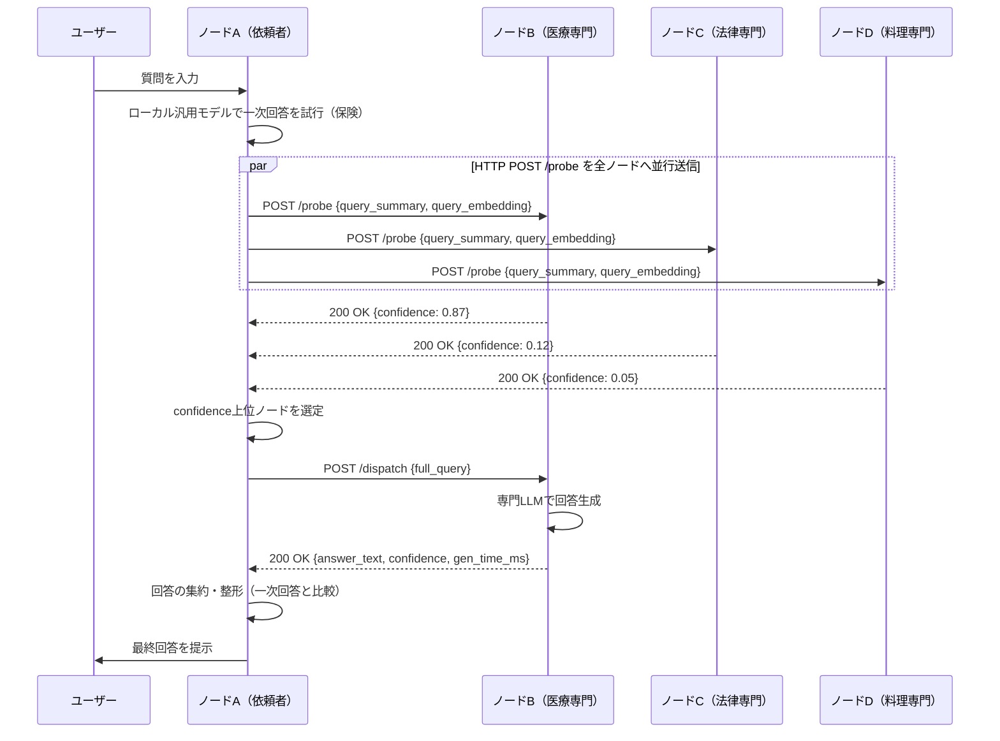

# 出会い型専門家メッシュ（Encounter-based Expert Mesh）
## 技術設計・実装計画・評価計画（v2：有線LAN常時接続・HTTP POSTプロトコル版）

対象規模：**CPUのみを搭載したノートPC数台（3〜6台程度を想定）**。GPUなし、クラウドなしを前提とする。

> **v2での変更点（今回の追加情報を反映）**
> - 実験環境は**有線LANで常時接続**されている前提に変更。無線アドホックの発見・接触モデルは今回のフェーズでは扱わない。
> - 「意図的な不安定性の注入（ネットワークエミュレーション）」は本フェーズでは行わない。安定ネットワーク下での基礎的な実現可能性の検証に集中し、不安定性・動的トポロジーへの拡張は将来課題として明記する。
> - 通信プロトコルは**JSONをHTTP POSTでやり取りする形式**に統一する（UDPブロードキャストやmDNSベースの発見は用いない）。

---

## 0. この文書の位置づけ

これまでの議論を踏まえ、本研究は次の3つの先行アイデアの交点に位置する。

| 由来 | 取り入れる要素 |
|---|---|
| WAFL（Wireless Ad Hoc Federated Learning、東京大学 落合・江崎研） | 中央サーバ不要・弱い同期・耐障害性という**設計思想**（今回のフェーズでは無線アドホック性そのものは扱わない） |
| distributed-llm（自作の分散CPU推論システム） | HTTP APIによるノード間通信、静的なノード一覧管理、ヘルスチェック等の運用ノウハウ |
| 先生とのディスカッション | 「重みを混ぜる」協調学習ではなく、「専門を分担し、担当デバイスが答える」協調推論への転換 |

本フェーズは「出会い（encounter）」という無線アドホック特有の要素を一旦切り離し、**有線LAN上の常時接続環境で、自律分散的な役割分担・ルーティングの仕組みそのものが機能するか**を検証する土台作りに位置づける。無線アドホック性・ネットワーク不安定性への拡張は、この土台が機能することを確認した後の次フェーズの課題とする。

---

## 1. 全体アーキテクチャ

### 1.1 登場するノードの役割

すべてのノードは対等（symmetric）であり、マスターは存在しない。各ノートPCは以下の機能を同時に持つ。

- **専門家（Expert）としての機能**：自分の専門分野のLLMをローカルで動かし、質問に回答する。
- **依頼者（Requester）としての機能**：ユーザーからの質問を受け取り、他ノードにHTTP POSTで問い合わせを行い、回答を集約してユーザーに返す。

各ノードはHTTPサーバとHTTPクライアントの両方の機能を持つプロセスとして実装する（distributed-llmの各ノードがHTTP API `/predict` を持っていたのと同様の構成）。

### 1.2 全体の流れ（概念図）



「軽い問い合わせ（`/probe`：担当可否のみ）→本問い合わせ（`/dispatch`：フル生成）」という**2段階プロトコル**は変更しない。HTTP POSTのリクエスト／レスポンスがそのまま「問い合わせ」と「応答」の往復に対応するため、v1で必要だったACKチェーンや非同期メッセージ種別（`probe_ack`・`answer`を別メッセージとして送る設計）は不要になり、**素直な同期的REST呼び出しとして実装できる**点がHTTP POST方式の利点である。

---

## 2. 技術的要素の詳細設計

### 2.1 推論エンジン層（CPU限定の制約を踏まえたモデル選定）

*（v1から変更なし）* CPUのみのノートPCでの実行可能性を、事前の技術調査に基づいて整理する。

| モデル規模 | CPU実測の目安（4bit量子化, llama.cpp/ollama） | 用途 |
|---|---|---|
| 1B〜3B（例：Llama 3.2 1B/3B、Qwen2.5 1.5B/3B、Phi-3-mini） | 一般的なノートPCで5〜10+ tok/s程度 | **担当可否判定・軽量ルーティング・一次回答用** |
| 7B級（例：Mistral-7B、Qwen2.5-7B） | 世代の新しいCPU（AVX2/AVX512対応）で15tok/s前後、非力なノートPCでは1〜5 tok/s | **専門家本体（フル回答生成）用** |
| 13B以上 | ノートPC単体では実用的な速度が出ない場合が多い | 本研究のスコープ外 |

有線LAN常時接続のため、システム全体のレイテンシは**ネットワーク遅延ではなくローカル推論時間（特に7B級モデルの生成時間）が支配的**になる。したがって評価においても、通信オーバーヘッドと生成時間を分離して計測することが重要になる（4.1節）。

### 2.2 専門家（Expert）の設計

*（v1から変更なし）* Step 0（オフザシェルフの分野特化モデルをノードごとに割当）→ Step 1（可能ならLoRAで特化、学習は別環境で実施）→ Step 2（RAGによる専門化、任意）の順で進める。

### 2.3 ノード管理・通信層（有線LAN常時接続を前提とした簡素化）

無線アドホックを想定した「出会い」の発見（mDNS等）は本フェーズでは不要になる。有線LANで全ノードが常時到達可能であることを前提に、**distributed-llmの`hosts.txt`と同様の静的なノード一覧ファイル**でノード間の宛先を管理する。

```yaml
# peers.yaml の例
nodes:
  - node_id: laptop-A
    host: 192.168.1.10
    port: 8080
    domain: general        # 依頼者兼任の場合はgeneralでも可
  - node_id: laptop-B
    host: 192.168.1.11
    port: 8080
    domain: medical
  - node_id: laptop-C
    host: 192.168.1.12
    port: 8080
    domain: legal
  - node_id: laptop-D
    host: 192.168.1.13
    port: 8080
    domain: cooking
```

各ノードは起動時にこの`peers.yaml`を読み込み、問い合わせ先の一覧を得る。動的な発見プロトコル（mDNS/Zeroconf）は実装せず、**ノード構成の変更（専門家の追加・入れ替え）は設定ファイルの更新で対応する**。これはWAFL本来の「動的な出会い」からは後退するが、「役割分担・ルーティングの仕組みそのものの妥当性」を切り分けて検証するための意図的な単純化であり、無線アドホック化は次フェーズの拡張ポイントとして明示的に切り出す（5節）。

なお、各ノードの現在の負荷状況や専門タグの微調整（例：LoRAの差し替え）を反映するため、**軽量なハートビート的送信**は残す。ただし通信手段はmDNSのアドバタイズではなく、これも通常のHTTP POSTで統一する（3.2節の`/advertise`エンドポイント）。

### 2.4 ルーティング層（「担当デバイスが正しく選ばれるか」）

*（v1から変更なし。方式A：埋め込みベースの意味的ルーティング、方式B：各専門家の自己申告スコアリング、の2方式を比較実装する）*

有線LANで通信が高速・安定しているため、v1で懸念していた「ブロードキャストの通信コスト」は本フェーズでは相対的に小さい。したがって、方式Bの「毎回全専門家に軽い問い合わせを送る」コストは無視でき、**方式Bを基本形として先に実装し、方式Aは事前計算コストの削減効果を測る比較対象として後から追加する**、という優先順位に変更する。

### 2.5 集約・フォールバック層

*（v1からほぼ変更なし）* ノード非応答時の扱いは、有線LAN常時接続の前提では「リンク不安定による欠落」ではなく「対象プロセスのダウン・タイムアウト」としてのみ発生する、と単純化する。

- **担当者不在の場合**：どの専門家からも高いconfidenceが返らなかった場合、依頼者自身の汎用モデルによる一次回答、または「わからない」という正直なフォールバックを返す。
- **複数専門家が名乗り出た場合**：上位k件（例：k=2）に`/dispatch`を送り、簡易な多数決またはLLM-as-judge方式で選択する。
- **タイムアウト設計**：HTTPクライアントのタイムアウト（例：`/probe`は2秒、`/dispatch`は30秒）を設定し、応答がない場合はそのノードを不在として扱う。有線LANでは基本的にタイムアウトはプロセス側の問題（起動していない、モデルロード中等）を意味するため、v1で想定していた「電波が届かない」ケースは今回は考慮しない。

---

## 3. 実装すべきアプリケーションの設計

### 3.1 ソフトウェア構成

```
encounter-expert-mesh/
├── node.py                   # 各ノードのメインプロセス（HTTPサーバ起動、役割の統括）
├── http_server.py             # FastAPI等によるHTTPサーバ（/advertise, /probe, /dispatch を提供）
├── http_client.py             # 他ノードへのHTTP POST送信（非同期・並行実行）
├── peers.yaml                  # 静的ノード一覧（host, port, domain）
├── router.py                    # 方式A/Bのルーティングロジック
├── expert_backend.py             # ollama/llama.cppへのHTTPクライアント（ローカル推論）
├── aggregator.py                  # 複数応答の集約・フォールバック処理
├── protocol.py                     # JSONメッセージのスキーマ定義（pydantic等）
├── config.yaml                      # ノードごとのモデル名・タイムアウト設定
├── data/
│   └── dataset.jsonl                # 評価用データセット
├── build_dataset.py                 # 評価用データセット生成
├── run_experiment.py                # 実験自動実行（質問投入・ログ収集）
├── metrics.py                       # 評価指標の計算
└── tools/
    ├── healthcheck.py                # 全ノードの生存確認（distributed-llmから移植）
    └── show_logs.py                   # ログ収集（distributed-llmから移植）
```

v1にあった`discovery.py`（zeroconfベース）と`network_emulation/`（tc/netem設定）は本フェーズでは削除し、静的な`peers.yaml`に置き換えた。

### 3.2 通信プロトコル（JSON over HTTP POST）

各ノードはHTTPサーバ（例：FastAPI + uvicorn）を立て、以下の3つのエンドポイントを提供する。すべて **JSONボディのPOSTリクエストとJSONレスポンス** で完結させ、v1にあった別送の`probe_ack`・`answer`メッセージは廃止し、**HTTPのレスポンスとして直接返す**（distributed-llmの`POST /predict` → `{"result": ...}` という応答パターンと同じ形式に統一する）。

**① `POST /advertise`** — 自ノードの現在状態をピアに周知する軽量なハートビート（任意・低頻度でよい）
```json
// Request
{"node_id": "laptop-B", "domain": "medical",
 "domain_embedding": [0.12, -0.03, "..."], "load": 0.2, "timestamp": 1730000000}
// Response
{"status": "ok"}
```

**② `POST /probe`** — 依頼者から各ノードへ、担当可否のみを問い合わせる（軽量モデルで即答）
```json
// Request
{"request_id": "uuid-1234", "query_summary": "頭痛と発熱についての質問",
 "query_embedding": [0.08, 0.11, "..."], "from": "laptop-A"}
// Response（同期的にそのまま返す）
{"request_id": "uuid-1234", "node_id": "laptop-B",
 "confidence": 0.87, "estimated_latency_ms": 4200}
```

**③ `POST /dispatch`** — 依頼者から選定された専門家へ、本文の回答生成を依頼する
```json
// Request
{"request_id": "uuid-1234", "full_query": "3日前から頭痛と38度の発熱が..."}
// Response
{"request_id": "uuid-1234", "node_id": "laptop-B",
 "answer_text": "...", "confidence": 0.87, "gen_time_ms": 6100}
```

**エラー応答の形式**（distributed-llmのエラー形式を踏襲）：
```json
{"error": "model not ready"}       // 503: モデルロード中
{"error": "timeout"}                // 504: 応答なし
{"error": "invalid request"}        // 400: JSON形式不正
```

**依頼者側の実装方針**：`/probe`は全ピアに対して`asyncio` + `aiohttp`（または`httpx.AsyncClient`）で**並行**にPOSTし、一定時間内（例：2秒）に返ってきたレスポンスだけを集計する。有線LANであれば往復遅延はミリ秒オーダーであるため、並行POSTの合計待ち時間は最も遅いノードのローカル推論時間（軽量モデルでも数百ms程度）にほぼ支配される。

### 3.3 実装ロードマップ（netemによる不安定性注入フェーズを削除し再構成）

| フェーズ | 内容 | 成果物 |
|---|---|---|
| Phase 0（2〜3週間） | ノートPC2〜3台で`peers.yaml`＋HTTP POSTベースの`/probe`・`/dispatch`を実装し、固定2〜3ドメインのollamaモデルで動作確認 | 動作デモ、プロトコルの疑似コード検証 |
| Phase 1（3〜4週間） | ルーティング方式A/Bの実装、担当可否判定の精度計測、専門家台数を5〜6ドメインに拡張 | ルーティング精度の初期数値（安定ネットワーク下） |
| Phase 2（3〜4週間） | フォールバック（担当者不在・複数候補時の集約）の実装、ベンチマーク（4章）の構築、比較実験の実施 | ベンチマークデータセット、実験結果 |
| Phase 3（将来課題・任意） | 無線アドホック化（mDNS/BLE等による動的発見）、ネットワーク不安定性の注入（tc/netem等）、動的トポロジーへの対応 | v1で構想していた「出会い型」の完全版。今回のフェーズの後続課題として切り出す |

---

## 4. 評価計画

### 4.1 評価すべき軸の分解

| 評価軸 | 指標 | 何を測るか |
|---|---|---|
| ① ルーティング精度 | Top-1/Top-k正解率、適合率・再現率、誤ルーティング率 | 正しい専門家が選ばれるか |
| ② 回答品質（担当が正しい場合） | ドメインQAベンチマークでの正答率／LLM-as-judgeスコア | 選ばれた専門家が実際に良い回答をするか（≒専門家個体の性能） |
| ③ システム全体の実効性 | ①×②を統合したEnd-to-End正答率、レイテンシ内訳（通信時間 vs ローカル推論時間）、通信バイト数 | ユーザー視点での総合的な使い勝手、およびボトルネックの所在 |
| ④ 動的環境での頑健性（**本フェーズでは評価対象外・将来課題**） | ネットワーク不安定時の成功率低下率、フォールバック発火率、復旧時間 | 有線LAN常時接続の前提では測定不能。3.3節Phase 3で扱う |

③のレイテンシ内訳について、有線LAN常時接続かつHTTP POST方式では、**通信時間（HTTPリクエスト/レスポンスの往復）とローカル推論時間（トークン生成）を明確に切り分けて計測できる**ことがメリットである。これにより、「役割分担システムとしてのオーバーヘッド」が具体的に何ミリ秒なのかを定量的に主張できる。

### 4.2 比較対象（ベースライン）

*（v1から変更なし。ネットワーク条件に依存しない比較軸のため据え置く）*

| ベースライン | 目的 |
|---|---|
| (a) 単一汎用小型モデル（専門化なし、全ノード共通） | 「専門分化そのものにメリットがあるか」を測る最も基本的な対照群 |
| (b) 中央集権ルーター（1台のノートPCに全専門家を集約し、LiteLLM+ollama等でルーティング） | 「分散アーキテクチャであること」自体のコスト・オーバーヘッドを測る主要な比較対象 |
| (c) オラクルルーティング（正解ドメインが常に分かっている場合の上限） | ルーティング精度の理論的上限を示す参照点 |
| (d) クラウド大規模モデル（GPT-4級、参考値） | エッジ・オフライン環境でどこまで肉薄できるかを示す参考上限 |

「全データをまとめて学習した単一モデル」は正式な比較対象としては採用しない（構造が違いすぎるため）。

**本フェーズでの比較の焦点**：有線LAN常時接続という中央集権方式にとって最も有利な条件下で、あえて分散方式(本提案)と中央集権方式(b)を比較する。この条件で分散方式が(b)に対しどの程度のオーバーヘッド（追加レイテンシ・通信コスト）で同等の精度を達成できるかを示せれば、「不利な条件（無線アドホック等）に持ち込んだ場合にはむしろ有利になりうる」という将来の仮説（v1で立てていた主張）への布石となる。

### 4.3 評価用データセットの構築

*（v1から変更なし）* 階層1（MMLU-Pro等の既存ドメインラベル付きベンチマークの再構成）と階層2（社会実装シナリオを意識した自作データセット：地域の困りごと相談を想定した50〜100問、複合ドメインの質問を含む）の二階層で構築する。

### 4.4 実験環境

- ノートPC 3〜6台。**すべて有線LAN（同一スイッチ配下）で常時接続**し、`peers.yaml`にIPアドレスを固定的に記載する。
- ネットワーク条件の人為的な変化（遅延・損失注入）は本フェーズでは行わない。安定ネットワーク下での基礎性能（ルーティング精度・レイテンシ内訳・通信オーバーヘッド）の測定に注力する。
- 各ベースラインについて、階層1・階層2のベンチマークをそれぞれ実行し、4.1の①〜③の指標を記録する。
- ログはdistributed-llmのログフォーマット（`[LEVEL] メッセージ`、ノードIDつき）を踏襲し、後解析を容易にする。各HTTPリクエストの送信・受信タイムスタンプを記録し、通信時間とローカル推論時間を分離して集計できるようにする。

### 4.5 想定される主張（本フェーズの落としどころ）

v1では「ネットワーク不安定時の優位性」を主張の中心に据えていたが、本フェーズでは評価しないため、まずは次の実現可能性の主張に落とし込む。

> 「有線LAN常時接続という中央集権方式に有利な条件下であっても、HTTP POSTベースの自律分散ルーティング（出会い型メッシュの静的近似）は、中央集権ルーターに対して大きなオーバーヘッドなく比較可能な精度を達成できる。これにより、分散アーキテクチャを採用すること自体のコストが小さいことを示し、次フェーズで無線アドホック・不安定ネットワーク環境に拡張した際に中央集権方式に対する優位性を主張するための土台を築く。」

---

## 5. 制約・スコープの明記（今回の追加情報を反映）

- **ネットワーク前提**：全ノードは有線LANで常時接続されており、無線アドホックの発見・接触・断続的接続は本フェーズのスコープ外とする。この前提を評価結果の解釈における明示的な制約として論文・報告書に明記する。
- **通信プロトコル**：ノード間通信はすべてJSONをボディに持つHTTP POSTで統一し、UDPブロードキャストやmDNSといった発見プロトコルは用いない。ノード一覧は静的な設定ファイル（`peers.yaml`）で管理する。
- **将来拡張として切り出す事項**：①mDNS/BLE等による動的発見、②`tc netem`等によるネットワーク不安定性の注入と、それに対する頑健性評価（v1の4.1④軸）、③ノードの物理的な移動・動的トポロジー変化への対応。これらはPhase 3（3.3節）としてロードマップ上に残すが、本フェーズの実装・評価対象には含めない。
- ノード数は3〜6台程度に留め、大規模化は引き続きスコープ外とする。
- 専門家モデルは7B級以下に限定し、LoRA学習自体はノートPC外（GPU環境）で実施する。

---

## 6. 主な参考文献・関連システム

- Ochiai, H. et al. "Wireless Ad Hoc Federated Learning: A Fully Distributed Cooperative Machine Learning" (arXiv:2205.11779) — 中央サーバ不要・弱い同期の設計思想の由来（今回のフェーズでは無線アドホック性そのものは扱わない）
- Ueda & Ochiai, "WAFL-VQA" (IEEE CAI 2025) — WAFLをLLM/基盤モデルの個別化に応用した先行研究
- Ong et al., "RouteLLM" — 強弱モデル間の学習型ルーター
- Hu et al., "RouterBench" — マルチLLMルーティングの評価フレームワーク
- vLLM Semantic Router（Red Hat / vLLM Project）— 意味的埋め込みに基づく中央集権的ルーティングの実装例。MMLU-Proでのドメイン分類評価の前例
- Xue et al., "WDMoE: Wireless Distributed Mixture of Experts for LLMs" — 基地局とモバイル機器間でMoEを分散する研究。専門家は単一モデル内の事前学習済みエキスパートである点で本研究と異なる
- Borzunov et al., "Petals" / Ryabinin et al., "SWARM Parallelism" — 不安定ネットワーク上での分散LLM推論・学習（将来のPhase 3拡張時の参考）
- llama.cpp / ollama — 本研究のCPU推論基盤
- FastAPI / uvicorn, aiohttp — 本フェーズのHTTP POSTベースの通信基盤
- Linux tc/netem — 将来のネットワーク不安定性評価（Phase 3）用に参考として保持

---

## 7. まとめ：この設計が答えようとしている問い（本フェーズ版）

1. **有線LAN常時接続の環境において、多様な専門知識を持つノード群がHTTP POSTベースの軽量な問い合わせだけで「誰に聞くべきか」を自律的に決められるか**（ルーティング精度の評価）
2. **その自律分散的な仕組みは、最も条件の良い（＝中央集権方式に有利な）ネットワーク環境下でも、許容できるオーバーヘッドで中央集権方式と同等の性能を達成できるか**（実現可能性・コストの評価）
3. **その仕組みを、実生活に即した多様な質問（既存ベンチマークではカバーされない複合ドメインの質問を含む）に対して評価するためのベンチマークをどう設計すべきか**（評価手法そのものへの貢献）

無線アドホック性・ネットワーク不安定性への対応（v1で構想していた「出会い」の本質的部分）は、本フェーズで基盤となる役割分担・ルーティング機構が機能することを確認した上で、Phase 3として取り組む次の課題として明確に位置づける。
